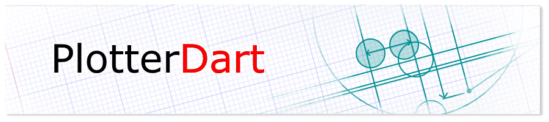

# 

A simple tool for drawing points, lines, and shapes in a panel which
can be zoomed, panned, and edited.

- [Running Example](#running-example)
- [Plotter Outputs](#plotter-outputs)
  - [Canvas](#canvas)
  - [SVG](#svg)
- [Items](#items)
  - [Circle Group](#circle-group)
  - [Circles](#circles)
  - [Ellipse Group](#ellipse-group)
  - [Ellipses](#ellipses)
  - [Group](#group)
  - [Line Strip](#line-strip)
  - [Lines](#lines)
  - [Points](#points)
  - [Polygon](#polygon)
  - [Rectangle Group](#rectangle-group)
  - [Rectangles](#rectangles)
  - [Text](#text)
- [Attributes](#attributes)
  - [Color](#color)
  - [Directed Line](#directed-line)
  - [Fill Color](#fill-color)
  - [Font](#font)
  - [Point Size](#point-size)
  - [Transformer](#transformer)

## Running Example

- Requires [Dart 2.0](https://dart.dev/) or higher
- Run `webdev serve`
- Goto [localhost:8080](http://localhost:8080/) for SVG
- Goto [localhost:8080/?Canvas=true](http://localhost:8080/?Canvas=true) for Canvas

## Plotter Outputs

The plotter can target different outputs. Two built-in outputs are
to [SVG](#svg) and [Canvas](#canvas). Additional outputs can be
created by implementing [`IPlot`](./lib/src/plotter/iplot.dart)
and [`IRenderer`](./lib/src/plotter/irenderer.dart).

#### Canvas

The plotter can be rendered to an HTML canvas element by constructing a new
[`plotCanvas`](./lib/src/plotCanvas/plotCanvas.dart).

#### SVG

The plotter can be rendered to scalable vector graphics (SVG) elements by
constructing a new [`plotSVG`](./lib/src/plotSVG/plotSVG.dart).

## Items

The items are different types of data to draw.
All the items extends a [`PlotterItem`](./lib/src/plotter/plotter_item.dart).
Items can have zero or more [attributes](#attributes) applied to it which
set the color, size, etc. Each item also provides methods to easily
add attributes. An item can be enabled or disabled for easily showing or hiding
the item.

#### Circle Group

A circle group is a collection of circles which all have the same radii.
Creating the group will require the radii to use and the list of
x and y center points. The circle group is effected by [color](#color),
[fill color](#fill-color), and [transformer](#transformer) attributes.

#### Circles

A list circles which all have the different radii.
Creating the list will require the list of x and y center points
and each radii. The circles are effected by [color](#color),
[fill color](#fill-color), and [transformer](#transformer) attributes.

#### Ellipse Group

A ellipse group is a collection of ellipses which all have the same x and y radii.
Creating the group will require the x and y radii to use and the list of
x and y center points. The ellipse group is effected by [color](#color),
[fill color](#fill-color), and [transformer](#transformer) attributes.

#### Ellipses

A list ellipses which all have the different x and y radii.
Creating the list will require the list of x and y center points
and each x and y radii. The ellipses are effected by [color](#color),
[fill color](#fill-color), and [transformer](#transformer) attributes.

#### Group

A group is a collection of items. The attributes applied to the group
will be applied to the internal items unless overwritten by an attribute
on the contained item. The plotter is an extension of a group. Groups
also provide several methods for easily adding items. A group may also
contain a label for easily identifying.

#### Line Strip

A line strip is a collection of x and y coordinates which draw lines
connecting all the coordinates to the coordinate prior to it.
The line strip is effected by [color](#color), [transformer](#transformer),
[point size](#point-size), and [directed line](#directed-line) attributes.
A point size above 1.0 will draw a point at each coordinate. If directed line
is set to true then each line will have an arrow head at the end.

#### Lines

A set of lines is a collection of x and y coordinates which draw lines
connecting every other line to the coordinates to the coordinate prior to it.
This means each group of four `double`s defines a single line.
The lines are effected by [color](#color), [transformer](#transformer),
[point size](#point-size), and [directed line](#directed-line) attributes.
A point size above 1.0 will draw a point at each coordinate. If directed line
is set to true then each line will have an arrow head at the end.

#### Points

A set of points is a collection of x and y coordinates for each point.
The points are effected by [color](#color), [transformer](#transformer),
and [point size](#point-size) attributes.

#### Polygon

A polygon is a collection of x and y coordinates which draw a polygon which
may be filled. The polygon is effected by [color](#color),
[fill color](#fill-color), [transformer](#transformer),
[point size](#point-size), and [directed line](#directed-line) attributes.
A point size above 1.0 will draw a point at each coordinate. If directed line
is set to true then each line will have an arrow head at the end.

#### Rectangle Group

A rectangle group is a collection of rectangles which all have the same width and height.
Creating the group will require the width and height to use and the list of
left and top points. The rectangle group is effected by [color](#color),
[fill color](#fill-color), and [transformer](#transformer) attributes.

#### Rectangles

A list rectangles which all have the different width and height.
Creating the list will require the list of left and top points
and each width and height. The rectangles are effected by [color](#color),
[fill color](#fill-color), and [transformer](#transformer) attributes.

#### Text

A text item is a single line of text. The text has an x and y location
where the x is the left edge and the y is the baseline of the text.
The text can be set to auto-scale with the plot or to stay fixed on
the string with the `scale` flag.
The text is effected by [font](#font), [color](#color),
[fill color](#fill-color), and [transformer](#transformer) attributes.

## Attributes

#### Color

The color attribute sets the stroke or outline color of the items.
It is an red, green, blue, with an optional alpha color between 0.0 and 1.0.
This has an effect on all items.

#### Directed Line

The directed line attribute is a boolean to indicate if a line should
be drawn with an arrow at the end.
This effects [Line Strip](#line-strip), [Lines](#lines), and [Polygon](#polygon).

#### Fill Color

The fill color attribute sets the fill color of an item which can be filled.
This effects [Circle Group](#circle-group), [Circles](#circles), [Ellipse Group](#ellipse-group),
[Ellipses](#ellipses), [Polygon](#polygon), [Rectangle Group](#rectangle-group),
[Rectangles](#rectangles), and [Text](#text).

#### Font

The font attribute sets the font-family for the [Text](#text).

#### Point Size

The point size attribute indicates if a point should be drawn and the size to
draw the point in pixels.
This effects [Line Strip](#line-strip), [Lines](#lines), [Points](#points),
and [Polygon](#polygon).

#### Transformer

The transformer attribute will scale and offset the item or group.
This has an effect on all items.
